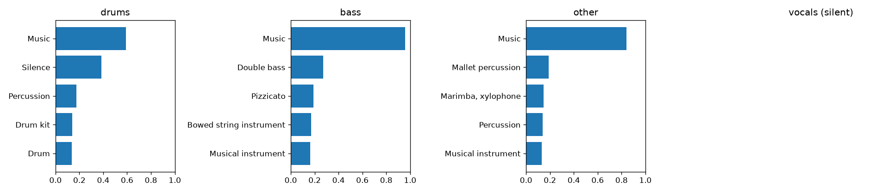

# Demucs + YAMNet Audio Pipeline

A two-stage audio AI pipeline:

1. **Separate** a mixture into stems (vocals, drums, bass, other) with **Demucs** (Meta's hybrid transformer source-separation model).
2. **Classify** every separated stem with **YAMNet** (Google's MobileNet-based model trained on AudioSet, 521 sound classes such as *Speech*, *Singing*, *Guitar*, *Drum kit*, *Dog*, *Siren*).

Separating first makes classification much cleaner: instead of one muddy label for the whole
mix, you learn what is in the vocal stem (speech vs. singing), the drum stem, and so on.

```text
audio file ──► Demucs ──► vocals.wav ─┐
                          drums.wav  ─┤
                          bass.wav   ─┼─► YAMNet ─► top-k labels + timeline ─► JSON / CSV / chart
                          other.wav  ─┘
```

## Project structure

```text
demucs-yamnet-audio-pipeline/
├── src/audio_pipeline/
│   ├── config.py      # model names, sample rates, thresholds
│   ├── audio_io.py    # load / resample / save helpers
│   ├── separate.py    # stage 1: Demucs
│   ├── classify.py    # stage 2: YAMNet (TensorFlow Hub)
│   ├── report.py      # JSON, CSV, bar chart
│   ├── pipeline.py    # glues the stages together
│   └── cli.py         # command line
├── scripts/
│   ├── download_examples.py     # fetch two freely licensed example clips
│   └── make_demo_audio.py       # synthetic, offline test clip
├── docs/              # example chart used in this README
├── tests/             # fast unit tests + one slow end-to-end test
├── input/             # put your audio here
└── output/            # results are written here (gitignored)
```

## Setup

Python 3.10–3.12. The first run downloads the model weights (Demucs ≈ 80 MB, YAMNet ≈ 15 MB) and caches them.

```bash
python3 -m venv .venv && source .venv/bin/activate      # Windows: .venv\Scripts\activate
# CPU-only machines: install the much smaller CPU build of PyTorch first (optional)
pip install torch torchaudio --index-url https://download.pytorch.org/whl/cpu
pip install -r requirements.txt
export PYTHONPATH=src                                    # Windows: set PYTHONPATH=src
```

The install is large (TensorFlow + PyTorch, roughly 1–3 GB). On a flaky connection add
`--retries 10` to the pip commands.

A GPU is optional. On CPU a one-minute track takes about 30–60 s end to end; Demucs uses
CUDA automatically when available.

## Usage

```bash
# full pipeline on one or more files
python -m audio_pipeline run input/song.mp3
python -m audio_pipeline run input/a.wav input/b.wav --model htdemucs_6s

# classify only the vocal stem
python -m audio_pipeline run input/interview.wav --stems vocals

# separation only / classification only (no separation)
python -m audio_pipeline separate input/song.wav
python -m audio_pipeline classify input/clip.wav

# try it without your own audio: two freely licensed clips (speech + music)
python scripts/download_examples.py
python -m audio_pipeline run input/speech_libri.ogg input/music_vibe_ace.ogg

# or a synthetic, fully offline test clip
python scripts/make_demo_audio.py && python -m audio_pipeline run input/demo_mix.wav
```

wav, flac, ogg and mp3 are read directly (libsndfile ≥ 1.1, bundled with `soundfile`);
other formats such as m4a need ffmpeg installed.

### Output

For `input/song.mp3` you get `output/song/`:

| File | Content |
|------|---------|
| `stems/<stem>.wav` | the separated audio |
| `results.json` | per stem: top-5 classes with scores, per-0.48 s timeline, RMS level and level relative to the loudest stem |
| `classification.csv` | the top-k table in flat form |
| `classification.png` | bar chart of labels per stem |

Real output for the two example clips (CPU, about a minute in total):

```text
input/speech_libri.ogg  (14.8s, demucs=htdemucs)
  drums    silent (-38 dB vs loudest stem)
  bass     silent (-33 dB vs loudest stem)
  other    silent (-27 dB vs loudest stem)
  vocals   Speech 0.98, Speech synthesizer 0.03, Narration, monologue 0.02
input/music_vibe_ace.ogg  (61.5s, demucs=htdemucs)
  drums    Music 0.59, Silence 0.38, Percussion 0.17
  bass     Music 0.96, Double bass 0.27, Pizzicato 0.19
  other    Music 0.84, Mallet percussion 0.19, Marimba, xylophone 0.15
  vocals   silent (-62 dB vs loudest stem)
```

The speech ends up alone in the vocal stem, and the instrumental track is split into
percussion, double bass and marimba with an empty vocal stem.



### Python API

```python
from audio_pipeline.pipeline import run
results = run("input/song.wav")
print(results["stems"]["vocals"]["top_classes"])
```

## Configuration

`src/audio_pipeline/config.py` holds the Demucs model (`htdemucs`, `htdemucs_6s`, `htdemucs_ft`), number of shifts (quality vs. speed), `TOP_K`, and the silence rules: a stem is reported as silent instead of being classified when its RMS is below
`SILENCE_RMS` or it is more than `RELATIVE_SILENCE_DB` (26 dB) quieter than the loudest stem. Such stems
only hold separation bleed, which YAMNet would otherwise label as "Silence", breathing or noise.

## Tests

```bash
pytest -m "not slow"     # fast unit tests, no model downloads
pytest                   # also runs the full pipeline (downloads weights)
```

## Notes and limitations

- Demucs is trained on music: the "vocals" stem for pure speech recordings works well, but the other stems will mostly be near-silent.
- YAMNet scores 0.96 s windows at 16 kHz mono; classification is multi-label, so scores need not sum to 1.
- Separation is imperfect; stems can contain bleed from other sources, which shows up in the labels.

## Credits

- [Demucs](https://github.com/facebookresearch/demucs) (Meta AI) and
  [YAMNet](https://www.kaggle.com/models/google/yamnet) (Google) are used under their own licenses.
- Example audio fetched by `scripts/download_examples.py`: a LibriSpeech excerpt (CC BY 4.0) and
  "Vibe Ace" by Kevin MacLeod, incompetech.com (CC BY 3.0), via librosa's example data.
